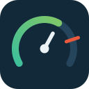

<p align="center">
  
</p>

<h1 align="center">AWS Quota Monitor</h1>

<p align="center">
  <a href="https://github.com/klaffka/aws-quota-monitor/actions/workflows/ci.yml"></a>
  
  
</p>

Collect AWS quota usage every ten minutes, keep versioned measurements in DynamoDB,
send SNS notifications for sustained breaches, and export monthly CSV reports to S3.
Each deployment monitors its execution account and configured Region.

The point of this project is that a number it reports can be trusted. A quota is
measured when an API can answer for it, and is recorded as `NO_DATA` or
`UNSUPPORTED` with a reason when it cannot. Nothing is estimated, and a missing
answer never becomes a zero that would read as headroom.

## Runtime behavior

- **Collector:** runs every ten minutes. Service Quotas catalog snapshots are cached
  for 24 hours. Compatible `UsageMetric` definitions are queried in batches of up to
  500 over an overlapping 20-minute window. The recommended statistic is used.
- **Source selection:** one source per service/quota. A compatible official metric
  takes precedence over a resource check. Missing official data does not trigger a
  switch to a different source or a fabricated zero.
- **Alarms:** at or above `QM_ALERT_THRESHOLD`, send an immediate breach notification,
  then reminders no sooner than 24 hours after the last successful notification.
  Send one recovery notification after valid usage falls below the threshold.
  Missing data, invalid limits and older calculation versions cannot send quota alerts
  or recoveries. Operational failures are monitored separately.
- **Automatic reports:** the complete previous calendar month in UTC, including leap
  years. The end is exclusive. The scheduler's original event time survives retries.
  Manual reports use `days_back`, defaulting to `QM_REPORT_DAYS` (30).
- **Failures:** successful checks are stored even when other checks fail. Failed checks
  and collector runs are recorded explicitly. Operational failures raise a Lambda
  exception so asynchronous retries and the Lambda `Errors` metric work.

## Coverage and accounting

| Area | Implemented usage |
| --- | --- |
| Official metrics | All discovered, regional account quotas with exact dimensions, supported units and a compatible statistic/window |
| Bedrock | Knowledge bases, agents, flows, custom/imported models, guardrails, inference profiles, prompts, Automated Reasoning policies and parent-scoped KB/agent/flow counts from paginated control-plane inventories; Data Automation blueprints per account and per project split by modality; agent collaborators and action-group function parameters; Advanced Prompt Optimization jobs split into running and retained |
| AppStream 2.0 | Fleets, stacks, private images, 502 instance-type/image-type quotas, 15 platform-scoped builder/session quotas, image sharing/copies and user-pool users; explicit data gaps for unstable capacity and unresolved builder states |
| Bedrock AgentCore | Agents, memories, gateways, identities, credential providers, custom tools, browser profiles, policy engines and payment managers; parent-scoped endpoints, versions, targets, policies, connectors and memory strategies; active sessions across custom and system tools |
| IoT Core | Dynamic thing groups, job templates, scheduled audits, mitigation actions, custom metrics, fleet metrics and streams from paginated inventories; security profile behaviour value elements, job targets, command parameters, unfinished command executions and both fleet index filters |
| Amazon Connect | 37 quota checks including instance inventories, typed integrations, routing queue/channel combinations and data-table attributes; highest utilization using each instance's applied limit |
| Clean Rooms ML | 129 training-instance types plus total instances, training/inference jobs, model versions, active input channels, algorithm associations and audience jobs; all creator memberships and model versions |
| DLM | Lifecycle policies and target accounts per sharing rule |
| Glacier | Vaults per account |
| Data Exchange | Data sets per account |
| Recycle Bin | Retention rules per Region and tag pairs per rule |
| MediaLive | CloudWatch Alarm Templates and EventBridge Rule Templates |
| EC2 networking | Transit gateways, customer gateways and virtual private gateways |
| Direct Connect | Maximum dedicated connections per location and virtual interfaces per connection |
| Cognito / AppStream | Cognito custom domains and AppStream active fleets |
| Rekognition | Custom Labels projects and maximum model versions per project |
| Ground Station / MediaPackage | Maximum dataflow endpoints per group and origin endpoints per channel |
| SSM Quick Setup / SAP | Configuration managers and SAP applications |
| Social Messaging / WorkSpaces | WhatsApp Business Accounts and IP access control groups |
| IAM Identity Center | Permission sets, groups and users across discovered Identity Center instances |
| Service Catalog / Supply Chain / Timestream InfluxDB | AppRegistry applications, Supply Chain instances and InfluxDB database instances |
| S3 / WorkSpaces parent-scoped | Maximum replication rules per bucket and IP access groups per directory |
| Application Discovery | Imported servers per account |
| SSM Incident Manager | Replication sets per account |
| WorkSpaces Managed Instances | Managed instances per Region |
| AWS re:Post | Private spaces per account |
| CloudWatch Evidently | Projects per account |
| AWS RAM | Resource shares, resource/principal associations at account and share scope, customer-managed permissions, and pending invitations |
| SSM Contacts | Contacts and rotations per account |
| Well-Architected Tool | Review templates, lenses and workloads per Region, plus lenses per template/workload and milestones per workload |
| Pinpoint | Projects and account-wide message templates across all five template types |
| EC2 | AMI sharing entities, VPN endpoints, authorization rules per VPN endpoint, active owned P4d/P4de Capacity Blocks from reservations |
| VPC | VPCs, gateways, subnets, CIDRs, ACLs, route tables, endpoints, peerings, NAT usage, network interfaces, security groups, VPC associations, BPA exclusions, RAM subnet sharing and NAU metrics |
| Lambda | Account code/layer storage; layers and environment bytes across function versions; resource-policy bytes across versions and aliases |
| RDS / DMS | Account attributes with AWS-reported usage and maximum for every matching account quota |
| IAM | Account-global users, roles, groups, policies, profiles and other `GetAccountSummary` usage/quota pairs |
| Step Functions | Registered state machines and activities, versions and aliases per state machine, plus official open-execution and open-Map-Run gauges |
| ECR | Registered repositories, maximum images per repository and pull-through cache rules from paginated regional inventories |
| Auto Scaling | Auto Scaling groups and launch configurations per Region from paginated inventories |
| Application Auto Scaling | Scalable targets by namespace, scheduled actions and scaling policies per target, and step adjustments per policy |
| API Gateway | Regional, edge-optimized and private REST APIs, maximum stages per REST API, and API Gateway V2 portals, portal products and product pages |
| ECS | Clusters, maximum services and container instances per cluster, and task-definition revisions per family |
| Firehose | Delivery streams per Region from the paginated regional inventory |
| EventBridge | Event buses and rules per Region from paginated inventories |
| CloudTrail | Trails, event data stores, channels and custom dashboards per Region from regional inventories |
| SNS | Topics and pending subscriptions per account and Region |
| Secrets Manager | Secrets per Region from the paginated secret inventory |
| Access Analyzer | Account/organization analyzers and maximum archive rules per analyzer |
| GuardDuty | Detectors, trusted IP sets, threat intelligence sets and filters per detector |
| Security Hub | Automation rules, custom actions, custom insights and member accounts |
| Transfer Family | Web apps, profiles, workflows, agreements, servers, VPC endpoint servers, certificates and connectors per account |
| Macie | Custom data identifiers and finding filters |
| Inspector | Suppression rules from the regional Inspector2 filter inventory |
| EFS | File systems and maximum access points per file system |
| FSx | File-system counts by ONTAP, Windows, OpenZFS and Lustre deployment type, including Cache_1 |
| Lake Formation | Registered paths, data lake administrators and LF tags |
| X-Ray | Groups and custom sampling rules per Region |
| App Mesh | Meshes, virtual services/nodes/routers/gateways and routes |
| Redshift | Clusters, nodes, snapshots, parameter groups and subnet groups |
| Timestream | Databases, tables and scheduled queries |
| RDS / Aurora resources | DB instances, clusters, snapshots, shard groups, subnet groups, proxies and parameter/option groups |
| Transcribe | Vocabularies, medical vocabularies, vocabulary filters and language models |
| Polly | Lexicons |
| Lex V2 | Bots and maximum versions per bot |
| Network Firewall | 25 account, policy, rule-group, TLS, VPC-endpoint and container quotas |
| Network Insights | Access scopes, paths, retained analyses and running analyses |
| SES | Tenants per account |
| Connect | Amazon Connect instances per Region |
| Audit Manager | Custom frameworks/controls, running assessments, framework controls and scoped accounts |
| Resilience Hub | Applications and resiliency policies |
| Storage Gateway | Stored/cached volumes and file shares per gateway, plus maximum shares per S3 bucket |
| Omics | Workflows, sequence stores, variant stores and annotation stores |
| IoT FleetWise | Vehicles, campaigns, signal catalogs, model/decoder manifests and state templates |
| Forecast | Predictors, dataset groups, datasets, forecasts, explainabilities and What-if resources |
| Pinpoint | Projects, active campaigns and active journeys from paginated regional inventories |
| Deadline Cloud | Farms, monitors, license endpoints and per-farm fleets, queues, workers, jobs, budgets and storage profiles |
| AppConfig | Applications, deployment strategies, configuration profiles and environments |
| EventBridge Scheduler | Schedules and schedule groups |
| Resource Groups | Resource groups per account |
| CloudFormation | Active stacks, stack sets, private registry types/versions and deployed template structure per Region |
| AppConfig | Applications, environments, configuration profiles and deployment strategies per Region |
| Service Catalog | Portfolios, products and service actions per Region from paginated inventories; delegated administrators through Organizations, reported as `NO_DATA` outside an organization |
| WAFv2 | Regional web ACLs, IP sets, regex pattern sets, rule groups and parent-scoped IP/pattern/ALB association maxima |
| S3 / SNS / WorkSpaces | Parent-scoped lifecycle/replication rules, SNS filter policies, WorkSpaces IP-group/rule maxima and connection aliases |
| Cloud Map | Custom attributes per instance using the instance detail inventory |
| Wisdom / Amazon Q in Connect | Knowledge bases and assistants per Region |
| Voice ID | Domains, watchlists, speakers and active enrollment/registration jobs per Region |
| ACM | Certificates per Region from the paginated certificate inventory |
| Cognito | User pools per Region from the paginated pool inventory |
| Backup | Backup vaults, plans, frameworks, report plans, framework controls and frameworks per report plan |
| Glue | Crawlers, databases, jobs, workflows, connections, triggers, tables, per-database table maxima, table versions, security configurations, ML transforms and schema registries from paginated regional inventories |
| EMR | Active clusters per Region |
| DataSync | Tasks per Region from the paginated task inventory |
| SageMaker | Notebook instances, pipelines, projects, model packages, model package groups, domains, user profiles, workteams, A2I UIs/flow definitions, experiments, trials, images, monitoring schedules, MLflow Tracking Servers and Studio spaces per Region; ml.p3 training, spot training, warm pool and processing instances, which AWS publishes no usage metric for |
| CodeBuild | Build projects per Region |
| CodePipeline | Pipelines per Region |
| CodeArtifact | Domains per account and repositories per domain |
| CloudWatch Logs | Log groups per Region |
| DynamoDB | Tables per Region |
| ElastiCache | Subnet groups, users, parameter groups, user groups and serverless caches per Region |
| DocumentDB | Clusters, instances and subnet groups per Region |
| Neptune | DB clusters, instances and subnet groups per Region |
| Bedrock | Knowledge bases, agents, flows, prompts, Data Automation blueprints and parent-scoped data-source/alias/action-group/version counts per Region |
| Rekognition | Custom Labels projects per Region |
| Comprehend | Active endpoints per Region |
| Textract | Adapters per Region |
| Direct Connect | Direct Connect gateways and LAGs per Region |
| IoT Core | Dynamic thing groups, job templates, scheduled audits, mitigation actions, custom metrics, fleet metrics and streams per Region |
| IoT Core service quotas | Role aliases per Region |
| AppSync | GraphQL APIs per Region |
| AWS Config | Config Rules per Region |
| DMS | Endpoints, replication instances, tasks, certificates, subnet groups, migration projects, data providers, data migrations and instance profiles per Region |
| Application Migration Service | Active applications per Region |
| Ground Station | Configs and mission profiles per Region |
| IoT SiteWise | Asset models, portals and gateways per Region |
| IoT TwinMaker | Workspaces per Region |
| RoboMaker | Simulation and robot applications per Region |
| WorkSpaces | Images, bundles, WorkSpaces and directories per Region |
| FinSpace | Managed kdb environments; per-environment clusters by AZ mode, users, scaling groups, volumes, databases and dataviews; live nodes by dedicated/scaling host type; volume, savedown and cache storage |
| Mainframe Modernization | Applications and environments per Region |
| Entity Resolution | Matching workflows, ID-mapping workflows, namespaces and schema mappings per Region |
| DataZone | Assets, glossaries, asset types and environments per domain |
| App Runner | Services, connections, auto-scaling/observability configurations, VPC connectors and per-service ingress connections |
| Amplify | Apps, domains, branches and webhooks per app per Region |
| Amplify UI Builder | Themes, views, components and forms per app |
| EVS | Environments per account and hosts per environment |
| Lightsail | Instances, databases and container services per Region |
| MediaStore | Containers per Region |
| MediaTailor | Source Locations and Channels per Region |
| Kinesis Video Streams | Video streams and signaling channels per Region |
| CodeDeploy | Applications per Region |
| EKS | Registered clusters plus maximum managed node groups and Fargate profiles per cluster |
| Redshift | Nodes from regional cluster inventory |
| EFS | File systems per account |
| MQ | Brokers per Region |
| Cassandra | Tables and keyspaces per Region |
| QLDB | Ledgers per Region |
| Cloud9 | Development environments per account |
| Resource Explorer | Views per Region |
| CloudWatch Logs | Log groups, resource policies, and maximum subscription/metric filters per log group |
| Application Signals | SLOs per Region |
| Amazon Location | Trackers, geofence collections, maps, API keys, place indexes and route calculators per account |
| AWS Cloud Map | Namespaces per Region, and maximum instances per service/namespace |
| AppIntegrations | Applications, event integrations and data integrations per Region |
| IoT Events | Alarm models per account |
| IoT Analytics | Pipelines, channels, data sets and data stores per account |
| PCS | Clusters per Region |
| Managed Grafana | Workspaces per Region |
| CloudWatch OAM | Links per Region |
| Network Monitor | Monitors per account and Region |
| GameLift Streams | Applications and stream groups per Region |
| Aurora DSQL | Single-Region clusters per Region |
| Payment Cryptography | Keys and aliases per Region |
| Private CA Connector for Active Directory | Connectors, templates per connector, and group access-control entries per template |
| Private CA Connector for SCEP | Connectors and challenges per connector |
| Serverless Application Repository | Public applications per Region |
| SWF | Registered domains per Region |
| CloudHSM | Clusters per Region and account |
| Amazon MSK | Configurations and replicators per account |
| AWS Proton | Services, environments, combined templates and components per account; environment-account connections, template versions and service instances at their quota scope |
| Migration Hub Refactor Spaces | Owned environments, applications, services and routes per account and Region across visible shared hierarchies |
| EC2 Image Builder | Owned components, workflows, recipes, pipelines and configurations; component/workflow parameter and size limits; per-recipe and per-distribution-Region maxima |
| Firewall Manager | Policies per organization and Region |
| MSK Connect | Custom plugins per Region |
| IAM Roles Anywhere | Profiles and trust anchors per Region |
| Internet Monitor | Monitors per Region |
| Route 53 Profiles | Owned profiles per Region and VPC, private hosted zone, and VPC endpoint associations per profile |
| DocumentDB Elastic | Elastic clusters per Region |
| DataBrew | Projects per account |
| Cognito Identity | Identity pools per account |
| Well-Architected | Workloads, lenses and review templates per Region, plus parent-scoped lenses and milestones |
| SSM Contacts | Contacts and rotations per account |
| Data Exchange | Data sets per account |
| Recycle Bin | Retention rules per Region and tag pairs per rule |
| Neptune Analytics | Graphs per Region |
| Elastic Load Balancing | Classic/ALB/NLB counts, target groups, listeners, certificates, NLB target-AZ maxima, ALB rules, trust stores and revocation quotas from paginated APIs |

Each collector run stores a `COVERAGE#<account>#<region>` snapshot with catalog scope,
measured/unsupported counts and grouped reasons. This makes unsupported quotas visible
and measurable as an improvement target instead of silently dropping them.

Coverage snapshots can be reviewed locally after exporting DynamoDB items (JSON scan
response, JSON list, or JSON-lines):

```bash
python scripts/coverage_inspector.py coverage-items.json
python scripts/coverage_inspector.py coverage-items.json --format json
python scripts/quota_coverage.py data/service-quotas-20251102T133323Z.json
python scripts/quota_coverage.py data/service-quotas-20251102T133323Z.json --format json
```

The utility is read-only and does not create an AWS client. It keeps only the newest
snapshot per account/region and ignores measurement rows. The table includes the
measured and `OK` percentages relative to the discovered catalog; an empty catalog is
shown as `-` rather than as an invented zero percent.

`quota_coverage.py` compares a local Service Quotas export with the registered check
registry and compatible official usage metrics. Both native AWS field names and
legacy camel-case exports are accepted. `Custom` and `Metric` can overlap; `Covered`
counts their union once per service/quota code, preferring account-level catalog
entries. The table includes an overall total. This is implementation availability,
not proof that the current account has permission or usable metric samples. The tool
is offline and does not contact AWS.

`quota_coverage.py` accepts several exports and measures the union, because no
single export is complete: `list_service_quotas` returns a different set with and
without `QuotaAppliedAtLevel`. `--update-progress` rewrites the audit document's figures, and `--baseline`
compares the totals with
`tests/fixtures/coverage-baseline.json` and exits non-zero on a regression, which
is how CI guards the number; `--write-catalog` regenerates the committed union in
`tests/fixtures/quota-catalog-union.json`, since the exports under `data/` are not
tracked. `quota_orphans.py` reports the opposite direction: implemented
quota codes that no export contains.

The table reports two denominators. `Coverage` counts every catalog quota, while
`OfMeasurable` excludes the quotas whose usage cannot be counted at all: EC2
request-bucket capacity and refill limits, per-second rates, and burst
allowances. A quota counts as a rate either by its name or because the catalog
states its period as one second. The exclusion applies only to quotas that no
check and no official metric already covers. A bucket's occupancy and a per-second peak cannot be derived from
one-minute CloudWatch sums, so no additional check would ever cover them.

Because an exclusion rule costs nothing to widen and instantly flatters the
figure, `compare_baseline` fails when the excluded count grows, exactly as it
fails on a coverage regression. Raising it takes the same review as any other
change to the number.

What remains open is sorted by shape rather than left as one total, because a
name that reads like a count does not mean an API can answer it:

| Shape | Quotas | What it would take |
| --- | ---: | --- |
| countable | 753 | the name describes a count; whether an API exposes that inventory has to be checked quota by quota |
| size or period | 792 | the bound applies to one payload or document, or states a period in time units, so there is no inventory to count |
| rate-shaped | 316 | a rate no exclusion rule matches, because the name states neither a window nor an operation |
| no SDK client | 148 | botocore ships no client for the service any more, so no inventory can be read until AWS restores one |
| organization-wide | 13 | the quota is counted over every account in the organization, which one account's credentials cannot see |

The last two mark work that cannot be done from here rather than work not yet
done. They stay in the denominator: a restored API or a second set of
credentials would make them countable again, and excluding them would raise the
reported share without measuring anything. Each is guarded — one test fails if
botocore ships a dropped service again, another if AWS starts publishing a usage
metric for a quota measured only because it had none.

The [current coverage audit](docs/quota-coverage-progress.md) records 5,040 of
12,081 catalog quotas with an implemented measurement method (41.72%), including
official metrics, which is 71.37% of the 7,062 measurable quotas. It also lists
the largest remaining gaps; near-total coverage has not yet been achieved.

Clean Rooms ML has methods for 140/148 catalog quotas (94.6%). Training-instance
counts sum `resourceConfig.instanceCount` for `CREATE_IN_PROGRESS` model versions
across the account's creator memberships. Completed `ACTIVE` model artifacts do
not consume training instances. The job counters include `CREATE_PENDING`, while
instance reservations in pending, cancelling or deleting states return `NO_DATA`
for the affected instance type. Missing version inventories and inconsistent
detail responses also prevent partial counts. Many instance quotas have an applied
limit of zero; their utilization percentage remains unavailable. See
[Clean Rooms ML quotas](https://docs.aws.amazon.com/clean-rooms/latest/userguide/clean-rooms-ml-quotas.html)
and [distributed-training resources](https://docs.aws.amazon.com/clean-rooms/latest/userguide/use-distributed-training.html).

Bedrock includes 36 model-specific batch-job quota checks. Foundation model IDs,
inference profiles and custom model base ARNs are resolved explicitly; completed
jobs are excluded and repeated job ARNs are deduplicated. `Submitted` and
`InProgress` jobs count. `Validating`, `Scheduled` and `Stopping` jobs for the target
model return `NO_DATA` because their exact quota-reservation semantics remain
unverified. Model mappings follow the [AWS batch inference model table](https://docs.aws.amazon.com/bedrock/latest/userguide/batch-inference-supported.html).

Another 25 Bedrock checks cover flow nodes and conditions, guardrail policy counts
and text lengths, published guardrail/prompt versions, and inference-profile
endpoints. Configuration maxima include both working drafts and stored versions.
Nested Flow `Loop` nodes currently return `NO_DATA` while their quota scope remains
unverified. Missing definitions, mismatched versions and failed pages cannot produce
a successful partial count. Guardrail policy text is not stored in measurements.

Sixteen further Bedrock checks cover Automated Reasoning policy configuration,
versions and tests, model-evaluation jobs/configuration, and concurrent model imports.
Policy maxima include drafts and published versions. Evaluation quotas distinguish
human and automated jobs and explicitly select model evaluations; unresolved
concurrency reservations return `NO_DATA`. The existing blueprint count now includes
both `LIVE` and `DEVELOPMENT` stages and counts each account-owned blueprint ARN once.
See the [coverage audit](docs/quota-coverage-progress.md) for sources and validation.

Data Automation also measures saved blueprint versions, schema size in characters,
library counts and vocabulary phrases across all languages in each library.
Systems Manager checks package/association versions, advanced-parameter policy
counts and document sharing. Private sharing uses the maximum recipient count per
document; public sharing counts documents across the account. The SSM document
inventory uses the SDK's owner filter. No parameter values or vocabulary phrase
text are requested by these checks.

Rekognition has methods for 13/92 catalog quotas, including Custom Labels model,
training and copy concurrency, Media Analysis jobs, stream processor concurrency
and Kinesis stream associations. The configured inference-unit ceiling is measured
per running model. Custom Labels inventories explicitly filter out other project
features. Label detection counts `STARTING` as its processing state; face search
counts `RUNNING`. Unresolved reservations return `NO_DATA`. These checks use service
metadata and do not download media files or model artifacts.

Connect Cases now measures all 14 content and configuration quotas: domains, fields,
layouts, templates, options, rules, related items, files, SLAs, custom-item fields and
parent/child option mappings. CloudFormation registry
checks measure privately registered resource types and live versions per resource,
module and hook; activated public extensions are excluded from private quotas.
CloudFormation also reads original and processed templates of active stacks and measures
twelve resource, parameter, output, mapping, size, dynamic-reference and identifier limits,
plus StackSet dependencies and queued operations.
Both JSON and YAML with CloudFormation intrinsic tags are supported; template contents
are not copied into measurement metadata.

Step Functions open executions and open Map Runs use the documented account-level
CloudWatch gauges even though Service Quotas omits their metric metadata. AWS defines
both gauges as approximate, best-effort signals.

AppStream availability is 527 of 529 catalog quotas (99.6%). Fleet instance counts
sum provisioned capacity across matching instance types, separating native, BYOL
and imported custom images. Idle On-Demand instances count; multi-session capacity
uses instances rather than session slots. Starting/stopping fleets, draining fleets
and discrepancies between desired and actual capacity return `NO_DATA`. Image-builder
instance quotas currently return `NO_DATA` outside `RUNNING`; the API does not expose
their quota reservation status. This limits live measurement success even though a
check exists. Elastic sessions include all authentication types and disconnected
sessions, grouped by platform and instance type. See
[AppStream capacity semantics](https://docs.aws.amazon.com/appstream2/latest/developerguide/appstream-dimensions.html)
and [image types](https://docs.aws.amazon.com/appstream2/latest/APIReference/API_Image.html).

AgentCore tool configurations count only customer-created tools. Active session
quotas include both customer and AWS system tools, using the `READY` status from
the [session API](https://docs.aws.amazon.com/bedrock-agentcore/latest/APIReference/API_ListBrowserSessions.html).
Parent-scoped checks report the largest individual parent's usage, while account
memory strategy quotas sum all memories. The pinned Boto3/Botocore 1.43.92 layer
includes the newer policy, payment and browser-profile APIs.
Gateway rate-limit checks also count entries and dimension keys per individual
rate-limit configuration.

EKS native cluster counts and externally registered cluster counts use separate
quotas. External registrations are discovered with `ListClusters(include=['all'])`
and identified through `DescribeCluster.connectorConfig`, as documented by the
[EKS cluster API](https://docs.aws.amazon.com/eks/latest/APIReference/API_Cluster.html).
EKS now has methods for all 12 quotas in the current BA catalog, including network
CIDRs, control-plane security groups, Fargate selectors/labels and subscriptions.
Managed node counts use actual backing Auto Scaling group membership; missing
inventory returns `NO_DATA`. Access-entry counts are available for catalogs that
contain that quota.

Connect checks resolve each instance's applied quota using its ARN as `ContextId`
and report the instance with the highest usage/limit ratio. Missing or mismatched
applied limits prevent a successful sample. Queue inventories select `STANDARD`,
and integration associations are filtered by type. Routing-profile checks count
queue/channel combinations, with normal and manual-assignment lists evaluated
independently. See the [Connect quota scopes and routing-profile limits](https://docs.aws.amazon.com/connect/latest/adminguide/amazon-connect-service-limits.html).

The optional AWS utilization-report exporter preserves its report ID for resumption
and rejects incomplete or inconsistent pages:

```sh
python scripts/export_quota_utilization.py --profile BA --region eu-central-1 \
  --output /tmp/quota-utilization.json
# If polling times out, resume using the ReportId in the .state.json file:
python scripts/export_quota_utilization.py --profile BA --region eu-central-1 \
  --output /tmp/quota-utilization.json --report-id REPORT_ID
```

It requires `servicequotas:StartQuotaUtilizationReport` and
`servicequotas:GetQuotaUtilizationReport` for the chosen profile. A live BA report
on 2026-09-11 returned six quotas, all already covered by compatible metrics. This
exporter is an investigation tool and does not add quotas to the coverage count.

Security-group rules are counted separately by direction and IP family. Each CIDR
and security-group reference counts; customer-managed prefix lists use their maximum
entries, and known AWS-managed lists use their documented weight. Unknown weights
are unsupported. ACL direction is separate and immutable deny entries are excluded.
Route counts separate IPv4/IPv6 and exclude propagated routes. ENI limits are evaluated
per AZ. Inventories with ownership filters exclude resources owned by other accounts.
NAT gateway inventory includes pending, available and deleting gateways.

These rules follow the [VPC quota documentation](https://docs.aws.amazon.com/vpc/latest/userguide/amazon-vpc-limits.html)
and [AWS prefix-list weights](https://docs.aws.amazon.com/vpc/latest/userguide/working-with-aws-managed-prefix-lists.html).
AMI public permissions are excluded from the count of shared accounts, organizations
and OUs, following [AMI quotas](https://docs.aws.amazon.com/AWSEC2/latest/UserGuide/ami-quotas.html).

Explicitly unsupported cases include:

- Global or resource-specific official quotas without an unambiguous regional resource
  context, unresolved metric dimensions, and unknown units/statistics.
- Bedrock guardrail versions remain unsupported because the available control-plane API
  has no list operation for versions. Flow and agent subresource counts use their
  parent-scoped list APIs and report the maximum parent usage; per-flow node limits,
  per-agent model/configuration limits and knowledge-base ingestion limits remain
  configuration or workload constraints.
- `Sum` metrics without an explicit quota rate window, sub-minute windows, or windows
  finer than CloudWatch's retained resolution. Counts are never silently treated as
  requests per second. `Maximum` uses 60-, 300- or 3600-second historical intervals
  according to data age; maxima are reduced over **all** response pages.
- Direct-upload Lambda package sizes remain unsupported because the Lambda
  inventory does not expose whether a ZIP came from direct upload or S3. Kafka
  mappings are counted when either `AmazonManagedKafkaEventSourceConfig` or
  `SelfManagedKafkaEventSourceConfig` is present and `ProvisionedPollerConfig`
  is absent or empty, which is Lambda's documented on-demand mode marker.
- RAM sharing through organizations/OUs when participant account membership cannot
  be established. The collector expands organization and OU principals when the
  Organizations APIs are permitted. Access errors invalidate the dependent inventory instead of
  reporting a lower count. NAU requires metrics for every inventoried VPC.
- IAM account summary values are account-global. They are stored under the configured
  Region as the monitor's execution scope; run the collector in one Region to avoid
  duplicate global notifications. IAM quotas not exposed by `GetAccountSummary` remain
  unsupported.
- ELB target counts are deduplicated per load balancer and target groups are counted
  through their explicit load-balancer associations. Classic load balancers, listener
  certificates, NLB targets per AZ, trust stores and revocation quotas are measured from
  their paginated APIs. ALB/NLB capacity reservations are read through
  `DescribeCapacityReservation`.
- KMS covers all five resource quotas: customer keys and custom key stores per Region,
  plus aliases, grants and completed or in-progress on-demand rotations per customer
  key. Key, alias, grant, store and rotation inventories are validated and deduplicated;
  only key types that support on-demand rotation are queried. Systems Manager standard
  and advanced parameters, documents, maintenance windows, patch baselines and State Manager
  associations, plus patch groups per baseline, are counted from their regional SSM inventories. Route 53 Resolver endpoint/rule,
  VPC/profile association and DNS Firewall domain-list/rule-group quotas use their
  paginated regional inventories. Resolver system rules and AWS-managed Firewall domain
  lists are excluded from customer-owned counts.
- Amazon MQ brokers are counted with `ListBrokers`; Directory Service Microsoft AD and
  AD Connector directories with `DescribeDirectories`; OpenSearch domains and
  OpenSearch Applications with their respective list APIs. Broker/domain/application
  counts are regional account inventories.
- Elastic Beanstalk applications, environments and application versions are counted
  through their paginated describe APIs. AWS Batch queues, compute environments and
  compute environments per queue use `DescribeJobQueues` and
  `DescribeComputeEnvironments`. S3 Access Points and Multi-Region Access Points use
  the account-scoped S3 Control list APIs. Elastic Beanstalk configuration templates
  are not inferred because the API requires an application/template context and has no
  unambiguous account-wide listing operation.
- CodeDeploy applications and the maximum deployment-group count per application use
  `ListApplications` and `ListDeploymentGroups`. CodeGuru Profiler profiling groups use
  `ListProfilingGroups`. CodeGuru Reviewer's "Allowed Code Reviews" is not counted:
  the API lists historical reviews, while the quota is an operation allowance rather
  than a current resource inventory. CloudWatch Alarms similarly has no matching
  Service Quota resource count in the local catalog.
- MemoryDB clusters, nodes, users, ACL/user groups, subnet groups and parameter groups
  are counted from the corresponding paginated `Describe*` APIs. QLDB ledgers and
  Cassandra tables/keyspaces use their available service APIs when the deployment
  layer exposes those clients.
- Client VPN endpoints and authorization rules are collected per endpoint. Site-to-Site
  VPN connections are counted per Region and the maximum number attached to one virtual
  private gateway is measured from `DescribeVpnConnections`. Route-advertisement and
  concurrent-client quotas remain workload/state limits without an equivalent resource
  count API.
- Amazon Personalize dataset groups, campaigns, solutions, recommenders, filters and
  schemas are counted through their paginated list APIs. Pending batch inference jobs,
  solution versions and data deletion jobs use their documented lifecycle states and
  quota scopes; per-group resources retain the dataset-group ARN in the measurement.
  See the [Amazon Personalize quotas](https://docs.aws.amazon.com/personalize/latest/dg/limits.html).
  SageMaker notebook instances, pipelines, MLflow Tracking Servers and Studio spaces
  are likewise counted from regional list APIs. Kendra has no quota entries in the
  local catalog; SageMaker instance-type and throughput quotas remain usage-metric or
  workload limits rather than resource counts.
- MediaConvert queues and custom job templates are counted through `ListQueues` and
  `ListJobTemplates`. IVS channels and recording configurations use their paginated list
  APIs. SES and the communication API-rate quotas remain unsupported where their local
  entries describe request rates or have no matching resource inventory quota.
- Macie member accounts and pending invitations are measured with `ListMembers` and
  `GetInvitationsCount`; Security Hub outstanding invitations use the corresponding
  `GetInvitationsCount` API. Access Analyzer account/organization analyzers and archive
  rules are already collected per analyzer; policy-generation and preview rate quotas
  remain operational limits.
- Clean Rooms collaborations, memberships and configured tables use paginated account
  inventories. Verified Permissions policy stores and the maximum policy-template count
  per store use their list APIs. App Mesh meshes use `ListMeshes`; Managed Blockchain
  has no local resource-count quota entries.
- WorkSpaces Web portals, trust stores, browser/user/network/IP settings, data-protection
  settings, session loggers and user-access logging settings are counted through their
  paginated list APIs. Identity providers per portal and certificates per trust store
  use the corresponding parent-scoped list operations.
- IVS storage, encoder and ingest configurations use the `ivs-realtime` paginated list
  APIs while retaining the `ivs` Service Quota catalog codes. This covers the remaining
  unambiguous IVS resource-count quotas.
- MediaLive channels and clusters, plus MediaPackage channels, are counted via their
  paginated list APIs. Other streaming quotas describe bitrate, tracks or request rates
  and are not treated as resource counts.
- MediaConnect entitlements, flows and retained bridge inventories are counted from
  paginated list APIs. Flow details supply the maximum output count per flow; Router
  inputs, outputs and network interfaces are counted in their reported Region.
- EC2 Dedicated Host quotas cover 140 catalog-backed instance families using
  paginated `DescribeHosts` results, host ownership and family metadata. Released
  hosts are excluded; allocated available hosts count even when they have no guest
  instances. Recovery/maintenance states and ambiguous family/owner data return
  `NO_DATA`; Outpost hosts require separate scope resolution. The inventory is cached
  across families, and only quotas present in the account catalog are checked.
  See the [host inventory API](https://docs.aws.amazon.com/AWSEC2/latest/APIReference/API_DescribeHosts.html)
  and [host states](https://docs.aws.amazon.com/AWSEC2/latest/UserGuide/dedicated-hosts-monitoring.html).
  Spot-request quotas still need workload-specific accounting. Pinpoint project-scoped
  in-app campaign quotas and the remaining CloudFormation version/operation limits
  require a parent resource or describe a rate constraint, so they remain unsupported
  rather than being estimated.
  MediaPackage V2 channel groups, channels per group and origin endpoints per channel
  use parent-scoped list operations with maximum-per-parent aggregation.
- Additional direct inventory checks cover Cloud Map namespaces, ACM Private Certificate
  Authorities, Athena workgroups and EventBridge Scheduler schedules/schedule groups.
- Clean Rooms membership-scoped analysis templates, table associations, ID namespace and
  mapping tables, and audience-model associations now use the maximum count across all
  memberships. Privacy-budget templates use the collaboration-scoped API and maximum
  per collaboration.
- Additional catalog-backed counts cover Application Signals SLOs per Region, AMP
  workspaces per Region and Voice ID domains per Region. The Application Signals quota
  per individual service remains unsupported because the list response has no stable
  service grouping key for a verified maximum.
- OpenSearch Serverless security, network, encryption and data-access policies are
  counted through paginated control-plane APIs. VPC Lattice covers all 16 resource
  quotas across Region, VPC, service network, service, listener, target group,
  resource-configuration group and association scopes. Owned regional resources are
  separated from shared resources by ARN account; parent links, lifecycle states and
  duplicate pages are validated. Its auth-policy size remains a configuration limit.
  See [VPC Lattice quotas](https://docs.aws.amazon.com/vpc-lattice/latest/ug/quotas.html).
  WorkSpaces Thin Client environments are also counted through their paginated API.

See [Service Quotas metric recommendations](https://docs.aws.amazon.com/servicequotas/2019-06-24/apireference/API_MetricInfo.html)
and [CloudWatch retention and pagination](https://docs.aws.amazon.com/AmazonCloudWatch/latest/APIReference/API_GetMetricData.html).
Quota discovery is limited to quotas returned by `ListServiceQuotas`, with individual
lookups for implemented resource checks. This is not coverage of every AWS limit.

## Data quality and schema

Measurements carry `calculationVersion: 2`, `qualityStatus` and `qualityReason`:

| Status | Meaning |
| --- | --- |
| `OK` | Complete query/inventory and valid, compatible usage/limit |
| `NO_DATA` | No samples, invalid/zero limit, missing required data, or partial report history |
| `UNSUPPORTED` | No verified measurement method for the quota/context |
| `ERROR` | API, permission, throttling, pagination or other operational failure |

`utilizationPct = usageValue / limitValue * 100`. Unknown utilization is null.
A complete empty resource inventory is a valid zero; an incomplete inventory is not.
Lambda byte counts remain precise; no magnitude-based unit guessing is used.

Existing measurement keys remain `QUOTA#<account>#<region>#quota#<code>` and
`TS#<UTC timestamp>`. Measurements retain the existing 64-day TTL. Alarm states use
`ALERT#<account>#<region>#<service>#<code> / STATE`, catalog snapshots use `CATALOG#`,
and run health uses `RUN#`. Catalog generations expire after three days; only a fully
written generation becomes the active snapshot. Alarm state has no TTL.

Historical records are not rewritten or deleted by this migration. Old or unverifiable
versions are excluded from reliable maxima and counted in `Excluded Samples`.
AWS's existing TTL expiration still applies. Do not expect corrected historical
resource usage to be reconstructed from faulty old values.

## Reporting

Reports are written to:

```text
s3://<bucket>/reports/<account>/<region>/<start>_<end>/quota-report-<id>.csv
```

CSV columns include the UTC interval, account, Region, unit, usage source, data quality,
sample counts, excluded samples, aggregation interval, maximum usage, and peak time.
`Current Limit` comes from the report-time quota catalog. `Limit at Usage Peak` is a
separate historical field: for official metrics it is populated only when a verified
stored sample matches the returned peak timestamp and unit without conflicting limits.
A blank historical limit means unknown, not the current limit.

Reports with missing data, historical gaps greater than 30 minutes, excluded legacy
samples, or operational failures are marked `PARTIAL`. Maxima retained in partial rows
are maxima of the verified available samples. Every CSV has a `.csv.json` sidecar with
overall status and operational errors, including errors that prevented quota discovery.
S3 object metadata also carries report status. The report is saved before operational
errors are raised. S3 upload failures raise directly.

History is paginated and reduced incrementally; it never combines accounts or Regions.
The compatibility schema still requires a DynamoDB table scan. Large catalogs/tables
can exceed Lambda's 15-minute budget or incur substantial read/query cost; inspect the
health alarms and report sidecar before relying on a result. Metrics may be sparse or
arrive late, and ten-minute resource snapshots can miss changes between runs.

## Configuration and local commands

Use Python 3.14 (matching Lambda), then install development dependencies:

```bash
python3.14 -m venv .venv
source .venv/bin/activate
python -m pip install -r requirements-dev.txt
ruff check src tests scripts
python -m pytest -q
```

The tests use mocks/stubs and block AWS network requests. They do not invoke Lambda.

For intentional local access to AWS:

```bash
export AWS_PROFILE=your-profile
export AWS_REGION=eu-central-1
export QM_QUOTA_TABLE=qm-quotalog
export QM_REPORT_BUCKET=your-report-bucket
python src/functions/quota-collector/main.py
python src/functions/reporting/main.py '{"days_back":30}'
python src/functions/reporting/main.py '{"period":"previous_month"}'
```

The collector writes DynamoDB and may send SNS notifications. Reporting reads AWS and
writes S3. These are live commands, separate from the test suite. Legacy
`src/qmreport/report.py` now forwards to CSV reporting; PDF generation and nonexistent
Service Quotas utilization-report API calls have been consolidated into the maintained
implementation. `src/qm-quotalist/main.py` refreshes the shared catalog schema.

| Variable | Default / behavior |
| --- | --- |
| `AWS_REGION` / `AWS_DEFAULT_REGION` | Explicit Region or configured session Region; DynamoDB uses that same Region |
| `QM_AWS_PROFILE` / `AWS_PROFILE` | Optional local profile; Lambda uses its execution role |
| `QM_QUOTA_TABLE` | `qm-quotalog` |
| `QM_ALERT_TOPIC_ARN` | Unset disables quota notifications |
| `QM_ALERT_THRESHOLD` | `80`, numeric and greater than 0, at most 100 |
| `QM_REPORT_BUCKET` | Required for reporting |
| `QM_REPORT_DAYS` | `30`; manual integer interval from 1 to 455 days |
| `QM_BUILD_PYTHON` | `python3`, interpreter used to build the dependency layer |

## Packaging and CI

Runtime dependencies and all their transitive versions are pinned in `requirements.txt`.
Development dependencies are separate. The layer builder selects Linux x86_64 wheels
for CPython 3.14, omits bytecode and uses stable archive ordering/timestamps. Terraform
hashes both the requirements and build script to trigger rebuilds.

```bash
bash deployment/build_layer.sh
python scripts/verify_package.py
terraform -chdir=deployment init -backend=false
terraform -chdir=deployment fmt -check
terraform -chdir=deployment validate
```

The package check imports every supported entry point from a function ZIP with only
the built layer and Python's standard library available. `.github/workflows/ci.yml`
runs workflow validation, correctness linting, dependency checks, compilation, tests,
layer construction, package imports, and Terraform checks without AWS credentials. Python, packaging, and
Terraform run as separate jobs, and CI uploads test results and the verified layer as
short-lived artifacts. Dependabot proposes weekly updates for Python packages, pinned
GitHub Actions, and Terraform providers.

Existing live Lambda invocation scripts are under `tests/manual/` and are excluded
from pytest. Run them explicitly only during a separately authorized live acceptance.
The reporting poller preserves the invocation start-time filter and ignores JSON
sidecars when selecting CSV results. Existing `scripts/` investigation tools are
retained. Local AWS catalog exports stay in the ignored `data/` directory; tests use
minimal anonymized fixtures and releases never include account-specific exports.

## Versioning and releases

The project follows Semantic Versioning. `VERSION` is the single version source and
`CHANGELOG.md` holds human-written release notes. Prepare a release from the Unreleased
section, review the generated metadata, and tag that exact commit:

```bash
python scripts/release.py prepare 0.1.0
python scripts/release.py check-tag v0.1.0
git tag -a v0.1.0 -m "Release v0.1.0"
git push origin v0.1.0
```

Pushing a matching stable tag reruns the complete CI and creates a GitHub release only
after every gate succeeds. It publishes the changelog section as release notes plus the
verified Lambda layer and a SHA-256 checksum. See [docs/releasing.md](docs/releasing.md)
for the complete procedure. The workflow does not deploy infrastructure or invoke AWS.

## Terraform operations

`deployment/variables.tf` defines `aws_region` (default `eu-central-1`), tags, alert email,
threshold, report bucket, S3 retention (90 days) and manual report interval (30 days).
Use your existing `terraform.tfvars`; optional values can be copied from
`deployment/terraform.tfvars.example`. Region changes target different AWS resources;
review a plan before applying them.

The deployment provides Lambda error/throttle alarms for both functions and an alarm
when no successful collector heartbeat arrives within a 30-minute evaluation period.
CloudWatch logs are retained for 30 days. The heartbeat is emitted only after collection,
storage and alert processing succeed. SNS subscriptions still need email confirmation.
The existing optional JSON-defined CloudWatch alarms remain opt-in and independent;
avoid configuring the same quota there when using collector notifications.

S3 lifecycle rules expire current and noncurrent versions after the configured retention
and remove orphaned delete markers. The bucket blocks public access. Lambda invocation
failures use AWS's [asynchronous retry behavior](https://docs.aws.amazon.com/lambda/latest/dg/invocation-async-error-handling.html).

For an existing installation, import pre-existing unmanaged log groups before applying
Terraform, so their retention can be managed without trying to recreate them. The
DynamoDB table and historical measurement keys remain in place. No deployment or live
Lambda invocation is performed by the implementation or local verification workflow.

DynamoDB leases and observation ordering suppress overlapping and repeated quota alerts.
The lease lasts 1000 seconds, longer than the maximum Lambda invocation. SNS and
DynamoDB do not share a transaction: if the process dies after SNS accepts a message
but before the state commit, a retry may publish it again. This narrow delivery ambiguity
cannot provide exactly-once delivery with standard SNS. Failed SNS calls never count as
successful sends, and expired leases can be acquired by later invocations.

## License

MIT; see [LICENSE](LICENSE).
